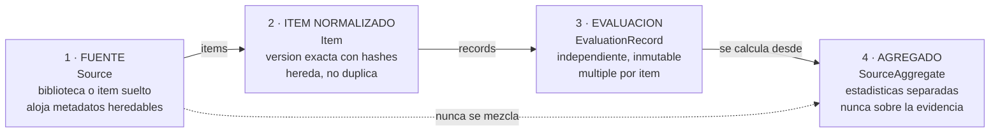

# ICAP v2: arquitectura de datos y protocolo

Documento de trabajo, rama `v2`. Registra la reestructuración de `spec/icap.allium` tras la evaluación arquitectónica, y el conflicto que esa evaluación destapó sin proponérselo.

La regla conceptual que ordena todo lo que sigue: PICTOS.net publica bibliotecas, ICAP produce registros de evidencia sobre versiones exactas de sus pictogramas.

## 1. Los cuatro objetos

El modelo anterior tenía un defecto que no se veía hasta que alguien lo nombró: la evaluación vivía como propiedad del pictograma. Un pictograma tenía su `judgment`, sus `thresholds`, su `eligible`. Eso funciona mientras haya un evaluador y una sola versión de cada ítem, y deja de funcionar en cuanto aparece el segundo de cualquiera de los dos.

La separación en cuatro objetos, con su correspondencia en la especificación:

El punto de la flecha punteada es el que más cuesta sostener en implementación: las estadísticas viven en su propio objeto y no se escriben nunca sobre los registros ni sobre los ítems. La garantía `EvidenceNeverMixed` en la surface del agregado lo fija como contrato.

## 2. El conflicto que la evaluación destapó

La evaluación no lo menciona, pero su propuesta rompe algo que acabábamos de construir. El veredicto de dos niveles de la revisión anterior —tres vetos duros más perfil compensatorio— estaba derivado sobre el pictograma, asumiendo un juicio por ítem. Con la evaluación convertida en registro independiente y múltiple, la pregunta se vuelve inevitable: si diez personas evalúan el mismo pictograma en contextos distintos, ¿de quién es el veredicto?

La respuesta sale del mismo principio que gobierna toda la v2, separar por origen del dato, aplicado ahora a los vetos:

| Veto | Origen | Dónde vive |
|---|---|---|
| A1 grosor bajo el mínimo | script sobre el pixel | versión del ítem |
| D1 par crítico en la familia | script sobre el set | versión del ítem |
| B2 ilegible al tamaño real | medición humana en un contexto | registro de evaluación |

A1 y D1 son deterministas y no dependen de quién evalúa: son propiedad de la versión del ítem y se computan una vez. B2 depende de una medición humana y del tamaño de presentación declarado en el contexto, de modo que el mismo pictograma puede aprobar para un tablero de escritorio y fallar para señalética lejana. Ese veto no puede vivir en el ítem.

La consecuencia es una mejora que no habíamos visto: al mover el tamaño de presentación desde la biblioteca hacia el contexto de evaluación, el instrumento gana la capacidad de decir que un signo es admisible para un uso e inadmisible para otro, en lugar de emitir un veredicto único descontextualizado. `Item.deterministic_verdict` y `EvaluationRecord.record_verdict` son ahora dos cosas distintas, y está bien que lo sean.

## 3. Qué se implementó ahora

Siguiendo tu ordenamiento de prioridades, los seis primeros puntos están en la especificación.

El modelo normalizado de entrada queda como `Source` más `Item`, con la regla `ImportSource` recibiendo un adaptador. Todo importador entrega el mismo modelo interno, de modo que aceptar mañana un pictograma suelto o una biblioteca de otro origen no toca el resto del instrumento. Un ítem individual genera una fuente de tipo `single_item`: no se finge pertenencia a una biblioteca real.

La herencia explícita queda como `EditorialMetadata` en la fuente más `overrides` opcional en el ítem, con los derivados `effective_author`, `effective_license`, `effective_organization` y `effective_language` que materializan la vista resuelta. El export de bundle lleva el campo `resolved_inheritance` para elegir entre vista compacta y resuelta.

La identidad de versión es la pieza central. Cada ítem carga `stable_id`, `item_version`, `image_hash`, `utterance_hash` y `content_hash`; cada registro congela `item_content_hash`, `source_id` y `source_version` al abrirse. El derivado `pinned_to_current` compara ambos: si el dibujo cambia o si la frase pasa de una redacción a otra, el registro anterior no se borra ni se corrige, queda marcado como referido a una versión superada. La proyección `superseded_records` los mantiene visibles y separados.

Las evaluaciones inmutables y múltiples quedan como `EvaluationRecord` con ciclo de vida de dos estados. La inmutabilidad es estructural: ninguna regla de escritura admite `status = sealed` en su precondición, de modo que sellar es irreversible por construcción y no por disciplina de interfaz.

El versionado separado viaja donde corresponde. La rúbrica dice qué significan los puntajes y el protocolo dice cómo se obtuvieron, así que ambas versiones van en el registro, no en la aplicación. La invariante `RecordDeclaresRubricAndProtocol` lo hace verificable, y `app_version` queda en la sesión, donde efectivamente pertenece.

El N/A con justificación y las notas tipadas quedan como `DimensionResponse` con cuatro estados y `Note` con cuatro tipos y visibilidad explícita. Tres invariantes sostienen la regla de que la ausencia de dato es un dato: solo el estado `scored` lleva puntaje, declarar falta de competencia obliga a decir respecto de qué, y ningún otro estado puede arrastrar un número. La garantía `NoForcedMidpoint` lo fija del lado de la interfaz.

## 4. Lo que se adelantó del siguiente tramo

Tres cosas del segundo bloque de prioridades entraron ahora, porque separarlas habría obligado a rehacer el modelo dos veces.

El doble momento de comprensión quedó modelado con transiciones, y esto resultó mejor de lo esperado. La prohibición de reescribir en silencio la respuesta espontánea no es una advertencia de interfaz sino una propiedad del grafo: el estado que permite escribirla no es alcanzable de vuelta una vez cerrado. La surface `SpontaneousComprehension` no expone la frase objetivo, y la garantía `TargetPhraseHidden` lo declara como contrato. Se registran tiempo de respuesta, seguridad declarada e idioma, y la codificación posterior es un rol distinto, `Coder`, que actúa después y no durante la sesión.

El informe de validación de ingesta quedó como `ImportReport` más `ValidationFinding`, con la invariante `NoSilentImport` impidiendo que la fuente avance sin informe, y dos garantías en la surface: nada se corrige en silencio y el informe es descargable antes de empezar.

La privacidad quedó parcialmente cubierta. El perfil se ancla a un seudónimo estable, el consentimiento tiene versión y alcance, y la invariante `PrivateConsentNeverPublished` impide que un export incluya el perfil cuando el alcance declarado es privado. Falta definir qué significa exactamente atributos agrupados en el export público, que es más una decisión de política que de modelo.

Los múltiples evaluadores y la agregación entraron como estructura pero no como cálculo: `SourceAggregate` existe y declara qué debe reportar, mientras que cómo se resume la capa C entre registros quedó como pregunta abierta. No es una omisión sino una decisión: los cuatro estados de respuesta no son intercambiables, y promediarlos juntos reintroduciría exactamente el problema que el estado explícito vino a resolver.

## 5. Lo que quedó registrado para después

El aparato de certificación completo —tamaños mínimos de muestra, umbrales de acuerdo interevaluador, firma o URL verificable, y vigencia, revocación y reevaluación del sello— está fuera del alcance de esta pasada y anotado como pregunta abierta. La infraestructura que necesita ya existe, sin embargo: sin identidad de versión y sin registros atómicos firmables no hay sello posible, y ambas cosas están ahora en el modelo.

También queda anotada la modularización de la especificación. El archivo único supera con holgura lo razonable y las tres fronteras naturales son claras: ingesta, evaluación y familia. Conviene esperar a poder correr `allium check` sobre las referencias cruzadas antes de partirlo, porque un módulo mal referenciado es peor que un archivo largo.

## 6. Efecto sobre el plan de fases

El plan de implementación anterior ordenaba las fases por capa de medición: primero capa A, luego módulo D, luego compuerta, luego capa B. Ese orden ya no sirve, porque la capa de ingesta y el modelo de registros son ahora prerrequisito de todo lo demás y no aparecían como fase.

El orden revisado antepone dos fases nuevas. La primera construye la ingesta normalizada con validación, herencia y hashes, que es lo que tu ordenamiento pone en primer lugar y sin lo cual ninguna evaluación es anclable. La segunda construye el registro de evaluación con sus estados, el doble momento y las respuestas tipadas. Recién después vienen las capas de medición en su orden anterior, y el agregado se construye al final del tramo porque necesita que existan registros reales sobre los cuales calcular.

El argumento para este reordenamiento es el mismo que usaste: hacerlo antes de seguir diseñando interfaz. Una interfaz construida sobre el modelo anterior tendría que rehacerse entera, mientras que una construida sobre el modelo de cuatro objetos sobrevive a la incorporación de múltiples evaluadores, de nuevas fuentes y del sello, porque las tres cosas ya tienen lugar en el modelo aunque todavía no tengan implementación.
