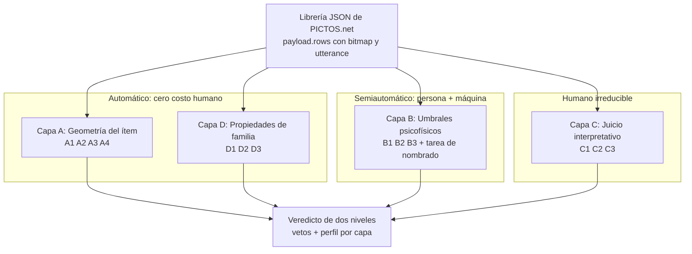

# ICAP v2: dimensiones, paradigmas y veredicto

**Repositorio**: `mediafranca/ICAP`, branch `v2`
**Documento complementario a**: `docs/ICAP_v2_especificacion.md`
**Propósito**: recuento de todas las dimensiones que mide la v2, el paradigma bajo el cual opera cada una, su grado de automatización, su escala de medición, y las consecuencias para el diseño de la interfaz. Cierra con una reflexión sobre qué se gana y qué se pierde respecto de v1.

## 1. Mapa general

La v2 no organiza el instrumento por *qué* mide sino por *quién puede producir el dato*. Esa única decisión genera cuatro capas, catorce dimensiones y tres regímenes de medición distintos: geometría computada, umbrales psicofísicos y juicio interpretativo.

## 2. Recuento de las catorce dimensiones

### 2.1 Capa A: geometría del ítem

Opera bajo el paradigma de la **organización perceptual** (psicología de la Gestalt reformulada experimentalmente): la hipótesis de fondo es que propiedades estructurales del estímulo (conectividad, cierre, grosor) predicen el costo de procesamiento visual antes de cualquier interpretación. Palmer y Rock aportan el principio de *uniform connectedness* como unidad primaria de organización[^1]; Kovács y Julesz, Elder y Zucker, y Marino y Scholl aportan la evidencia sobre cierre de contorno[^2]. La medición es puramente computacional sobre la máscara binaria figura/fondo extraída del bitmap.

| ID | Dimensión | Escala | Automatizable | Estado de evidencia |
|---|---|---|---|---|
| A1 | Grosor de trazo | razón continua, % del diámetro de soporte | sí, total | piso físico de legibilidad; magnitud local pendiente de recomputar |
| A2 | Unidades desligadas | conteo (componentes conexas) | sí, total | literatura (Palmer y Rock) |
| A3 | Regiones cerradas | conteo (huecos topológicos) | sí, total | literatura sólida, sin significancia local: se muestra como advertencia |
| A4 | Contorno inferido | razón continua, % del largo de esqueleto | sí, total | hipótesis: se etiqueta como exploratorio |

### 2.2 Capa B: umbrales psicofísicos

Opera bajo el paradigma de la **psicofísica clásica**, específicamente el método de ajuste: el observador manipula un control hasta el punto de transición perceptual, y ese punto, en unidades físicas, es el dato[^3]. No mide opinión sino desempeño en una tarea verificable (nombrar lo que muestra el pictograma). La máquina administra la degradación; la persona produce el umbral. Por eso es semiautomática: ~15 segundos por ítem por eje, sobre una submuestra del 20% del set.

| ID | Dimensión | Escala | Automatizable | Estado de evidencia |
|---|---|---|---|---|
| B1 | Umbral de desenfoque | continua, σ en px | semi: máquina degrada, humano responde | no redundancia entre ejes, pendiente de recomputar |
| B2 | Umbral de tamaño | continua, px de diagonal | semi | ídem |
| B3 | Umbral de desplazamiento | continua, px de barrido | semi | ídem |

Cada umbral se mide en doble pasada (nítido→degradado y degradado→nítido) por la histéresis propia del método; la diferencia entre pasadas es un indicador de confianza del dato, no ruido a descartar.

### 2.3 Capa C: juicio interpretativo

Opera bajo el paradigma **psicométrico clásico** de la evaluación por jueces con rúbrica anclada, heredero de la tradición de medición de translucidez simbólica en CAA[^4]. Es la única capa donde el instrumento de v1 sobrevive intacto: escala Likert 1 a 5 con descripciones operacionales por nivel. Se declara explícitamente no automatizable porque requiere competencia cultural y conocimiento del contexto de uso; automatizarla sería fingir que la máquina posee un juicio que no posee.

| ID | Dimensión | Escala | Automatizable | Estado de evidencia |
|---|---|---|---|---|
| C1 | Transparencia semántica | ordinal 1-5 | no, por diseño | rúbrica v1 sin cambios |
| C2 | Adecuación pragmática | ordinal 1-5 | no, por diseño | rúbrica v1 sin cambios |
| C3 | Adecuación cultural | ordinal 1-5, con N/A | no, por diseño | rúbrica v1 sin cambios |
| C4 | Aprendibilidad estimada | ordinal 1-5 | no, por diseño | constructo separado con respaldo de literatura CAA |

C4 se incorporó tras la evaluación externa y es la única dimensión que la v2 añade sobre el repertorio de v1. Su fundamento es que transparencia y facilidad de aprendizaje son propiedades distintas, no derivables una de otra: un signo opaco en el primer contacto puede volverse funcional tras pocas sesiones, y el peso relativo de las características del signo cambia con la experiencia del usuario[^6]. Sin C4 el instrumento penaliza por construcción a los sistemas de alta productividad composicional, donde la opacidad inicial es el precio deliberado de una gramática visual generativa.

El informe cruza C1 con C4 y reporta la celda resultante, no dos barras independientes: opaco pero aprendible es un veredicto de diseño distinto de opaco y difícil. Una limitación debe quedar declarada: C4 es una estimación del evaluador, mientras que los estudios que fundan el constructo midieron aprendizaje por exposición repetida. Es una aproximación operativa, no una medición.

### 2.4 Capa D: propiedades de familia

Opera bajo dos paradigmas complementarios. D1 se funda en la teoría de la **búsqueda visual**: la eficiencia para encontrar un objetivo depende de la similitud entre distractores, no solo de las propiedades del objetivo[^5]; en un tablero de CAA no basta reconocer un signo, hay que distinguirlo de sus vecinos. D2 se funda en la tradición del **diseño de sistemas de signos** (ISOTYPE, Aicher en Múnich 1972, AIGA/DOT): los signos deben leerse como miembros de un mismo sistema, cosa que esa tradición sí resolvió y que aquí se vuelve medible como coeficiente de variación intrafamilia.

| ID | Dimensión | Escala | Automatizable | Estado de evidencia |
|---|---|---|---|---|
| D1 | Confusabilidad de pares | correlación r entre 0 y 1, bajo degradación σ | sí, total | fundada en Duncan y Humphreys; verificada como discriminante en el set de referencia |
| D2 | Consistencia paradigmática | CV en %, cuatro rasgos estructurales | sí, total | tradición de diseño, operacionalizada |
| D3 | Ranking de fragilidad | ordinal (ordenamiento por umbrales B o sus proxies) | sí, total | derivada de B |

La capa D es la contribución original de la v2: ningún instrumento de evaluación de CAA mide hoy la confusabilidad interna de un set, y el hallazgo del análisis de referencia (un sistema puede ser paradigmáticamente coherente y a la vez cognitivamente inaccesible) solo es visible con este módulo.

## 3. Consideraciones para el diseño de interfaz

El input no cambia: librerías JSON exportadas de PICTOS.net (`payload.rows[]` con `bitmap` raster y `UTTERANCE`). Todo lo que sigue se deriva de esa continuidad y de la arquitectura por capas.

**El momento de carga es el momento de mayor valor.** Al cargar el JSON, las capas A y D se calculan en segundos sin pedir nada a nadie. La interfaz debe mostrar el informe preliminar de biblioteca inmediatamente después del paso 1, antes del perfil de evaluador: el usuario recibe diagnóstico antes de entregar un solo dato. Esto invierte la economía de v1, donde todo valor exigía trabajo humano previo.

**Cada capa exige su propia visualización y está prohibido fusionarlas.** El hexágono muere porque mezclaba unidades inconmensurables en un solo polígono. Lo reemplaza la ficha de tres bandas: barras con umbral marcado para A (cantidades contra criterio), valores en unidades físicas para B, y un triángulo (radar de tres ejes, ahora sí conmensurables) para C. La capa D vive en una vista independiente, el informe de biblioteca, accesible en cualquier momento: matriz triangular de confusabilidad con celdas clicables que muestran los dos pictogramas lado a lado degradados, tabla de CV, ranking de fragilidad.

**La honestidad epistemológica es un requisito de interfaz, no de documentación.** A3 se muestra como advertencia y no como puntaje; A4 se etiqueta como exploratorio; los umbrales por defecto son editables y quedan registrados en el export. La interfaz distingue tipográficamente lo verificado de lo hipotético.

**El protocolo B es una tarea, no una encuesta.** La pregunta al usuario es de desempeño (mueva el control hasta donde ya no pueda nombrar lo que muestra) con registro de la respuesta abierta como verificación. Requiere: doble pasada obligatoria por eje, punto de partida aleatorizado, orden de ítems aleatorizado, y barra de progreso sobre la submuestra (no sobre el set completo). Técnicamente todo se resuelve en `<canvas>` sobre el bitmap ya cargado, sin dependencias nuevas: la infraestructura de v1 alcanza.

**El resultado es un veredicto con causa nombrada, no un número.** El instrumento opera en dos niveles. Tres vetos duros actúan como condiciones necesarias no compensables: grosor bajo el mínimo, ilegibilidad al tamaño real de presentación y confusabilidad crítica con un vecino del mismo tablero. Son pisos físicos y relacionales, no predictores estadísticos, y por eso su justificación no depende de la magnitud de ninguna correlación local. Todo lo demás compone un perfil por capa que se reporta pero no elimina. Un ítem bloqueado siempre muestra cuál veto falló: nunca un rojo agregado sin causa identificada. No existe el puntaje ICAP único en v2, y la interfaz no debe reconstruirlo por la puerta trasera.

La razón de este diseño es que una regla que exige cumplir todos los criterios se vuelve multiplicativamente más severa con cada criterio que se le agrega, hasta rechazar prácticamente todo. Y una regla que rechaza todo informa exactamente lo mismo que una que acepta todo. La pregunta correcta no es conjuntiva contra compensatoria, sino cuáles criterios son condiciones necesarias, porque una condición necesaria es no compensable por definición.

**Carga humana total, explícita y baja.** Para una biblioteca de 50 ítems: cero en A y D, ~15 minutos en B (submuestra), ~35 minutos en C. La interfaz debe comunicar este presupuesto al inicio, porque es el argumento de operatividad frente a v1.

## 4. Qué ganamos y qué perdemos

**Ganamos enunciados falsables, que no es lo mismo que ganar validez.** Siete de catorce dimensiones se calculan con determinismo perfecto y tres más producen cantidades en unidades físicas. Conviene ser preciso sobre qué significa eso, porque una versión anterior de este documento lo sobrevendía. Determinismo no es validez: un algoritmo que cuenta componentes conexas produce el mismo número siempre, y eso no dice nada sobre si ese número predice que alguien reconozca el signo. Lo que la v2 hace es sustituir una fuente de error, la variabilidad entre jueces, por otra, la validez de constructo no establecida. La ganancia real es que un enunciado como *deja de leerse bajo cierto tamaño* es falsable, mientras que *3 de 5 en claridad* no lo es; pero falsable no es lo mismo que verificado.

Planteado correctamente, lo que se valida no es el instrumento sino la interpretación y el uso de sus puntajes, mediante una cadena explícita de inferencias donde cada eslabón necesita respaldo propio[^7]:

| Eslabón de la inferencia | Estado de la evidencia |
|---|---|
| El script mide la geometría que dice medir | verificable por reproducción; pendiente sobre el corpus completo |
| La geometría predice legibilidad perceptual | respaldo de literatura externa |
| La legibilidad predice reconocimiento por el usuario | sin evidencia propia |
| El reconocimiento predice utilidad comunicativa en contexto | sin evidencia propia |

Esto no invalida el instrumento; obliga a declarar qué inferencia sostiene cada afirmación que emite.

**Ganamos el nivel de análisis de familia**, que v1 no podía ver por construcción: dos signos casi indistinguibles bajo degradación eran invisibles para un instrumento que evalúa ítems aislados. Ganamos honestidad estructural, porque el veredicto de dos niveles impide que la adecuación cultural compense la ilegibilidad sin por eso rechazar todo por acumulación. Y ganamos tiempo humano: cuatro juicios Likert donde v1 pedía seis.

**Perdemos tres cosas reales.** Primero, la legibilidad retórica del hexágono: un polígono único era metodológicamente indefendible pero comunicacionalmente eficaz, se entendía en un segundo y viajaba bien en papers y presentaciones. La ficha de tres bandas es más honesta y más difícil de leer de un golpe; ese costo es genuino y hay que pagarlo con buen diseño, no negarlo. Segundo, la comparabilidad simple entre estudios: el puntaje promedio de v1 permitía ordenar bibliotecas con un número, y aunque ese orden fuera parcialmente ficticio, era operativo; el bloque `legacy_v1` del export mitiga pero no elimina esta pérdida, porque la derivación es aproximada. Tercero, algo más sutil: en v1 la reconocibilidad se juzgaba en condiciones óptimas (¿reconoce usted esto, aquí y ahora?), mientras que en v2 se mide como resistencia a la degradación. Son constructos parientes pero no idénticos; un pictograma podría nombrarse bien en condiciones plenas y degradarse temprano, o al revés. La v2 apuesta a que el segundo constructo es el que importa para accesibilidad, y esa apuesta es razonable pero es una apuesta.

También perdemos algo de bajo costo de entrada: v1 podía usarla cualquier persona con un navegador y criterio; v2 exige entender qué significa un umbral, una submuestra y una compuerta. La respuesta correcta no es simplificar el instrumento sino que la interfaz absorba esa complejidad, que es exactamente lo que el flujo por pasos intenta hacer.

## 5. Veredicto

La dirección es correcta, con dos condiciones.

Es correcta porque la v2 resuelve las tres limitaciones estructurales de v1 con una sola decisión arquitectónica (separar por origen del dato) en lugar de parchar cada limitación por separado, y porque cada dimensión queda anclada a un paradigma con literatura citable en vez de flotar como criterio ad hoc. El instrumento resultante es más barato de operar, más difícil de falsear involuntariamente y produce un objeto nuevo (el informe de familia) que constituye argumento de publicación por sí mismo. Además preserva lo que de v1 merecía sobrevivir: la rúbrica interpretativa, la pregunta abierta de comprensión pragmática (reciclada como verificación del protocolo B) y la continuidad del formato de entrada.

Las condiciones. Primera: la v2 vive o muere en la disciplina de sus etiquetas. Si la interfaz deja que A4 o A3 se lean como puntajes validados, o si alguien reconstruye un número único promediando capas, el instrumento se vuelve una versión más elaborada del mismo error que corrige. La sección de vetos de la especificación no es un apéndice, es el contrato. Segunda: la evidencia local está en revisión. El análisis de referencia corrió sobre trece pictogramas cuando el corpus es de veintiuno, de modo que toda cantidad local citada en estos documentos queda en suspenso hasta recomputar[^8]. La arquitectura no depende de esos datos, depende de la literatura externa, y esa asimetría acaba de ponerse a prueba: al caerse las cifras locales, las decisiones de diseño que se sostenían en literatura citable siguieron en pie y las que se apoyaban en el corpus propio quedaron aplazadas. Los umbrales pertenecen al segundo grupo y siguen declarados como propuestas sin calibrar. El paso honesto siguiente, después de implementar las capas A y D, es recomputar sobre el corpus completo y correr el instrumento sobre dos o tres bibliotecas de estilos distintos antes de fijar umbral alguno.

Con esas dos condiciones en pie, v2 no es una versión incremental: es el paso de una rúbrica a un instrumento de medición. Vale la pena construirla.

[^1]: Palmer, S. y Rock, I. (1994). Rethinking perceptual organization: The role of uniform connectedness. *Psychonomic Bulletin & Review*, 1(1), 29-55. Fundamenta A2.

[^2]: Kovács, I. y Julesz, B. (1993). A closed curve is much more than an incomplete one. *PNAS*, 90(16), 7495-7497; Elder, J. y Zucker, S. (1993). *Vision Research*, 33(7), 981-991; Marino, A. C. y Scholl, B. J. (2005). *Perception & Psychophysics*, 67(7), 1140-1149. Fundamentan A3. Nota: región cerrada (cierre topológico) no es sinónimo del principio gestáltico de *closure* (completación perceptual de contornos interrumpidos).

[^3]: El método de ajuste es uno de los tres métodos clásicos de Fechner. La ruta futura de precisión, no implementada en v2, es QUEST: Watson, A. B. y Pelli, D. G. (1983). QUEST: A Bayesian adaptive psychometric method. *Perception & Psychophysics*, 33(2), 113-120.

[^4]: Fuller, D. y Lloyd, L. (1991). Translucency: An important characteristic of symbols. Citado en la rúbrica v1 (`docs/rubric.md`), cuyas descripciones operacionales por nivel se conservan para C1, C2 y C3 desde `data/rubric-scale-descriptions.json`.

[^5]: Duncan, J. y Humphreys, G. W. (1989). Visual search and stimulus similarity. *Psychological Review*, 96(3), 433-458. Fundamenta D1 y D2. La dificultad de búsqueda crece con la similitud objetivo-distractor, que es lo que mide D1, y decrece con la similitud entre distractores, que es lo que mide D2. Los dos términos están en tensión: el objetivo de diseño es alta homogeneidad de estilo con baja similitud de silueta. Evidencia con la población destinataria: Wilkinson, K. et al. (2013). Perceptual factors influence visual search for meaningful symbols in individuals with intellectual disability. *AJIDD*, 118(5), 353-364. La evidencia autismo-específica sobre procesamiento global es de costo temporal, no de incapacidad: Van der Hallen, R. et al. (2015). Global processing takes time. *Psychological Bulletin*, 141(3), 549-573.

[^6]: Mizuko, M. (1987). Transparency and ease of learning of symbols represented by Blissymbols, PCS and Picsyms. *AAC*, 3(3), 129-136; Alant, E. et al. (2013). Translucency ratings of Blissymbols over repeated exposures by children with autism. *AAC*; Isherwood, S., McDougall, S. y Curry, M. (2007). Icon identification in context: The changing role of icon characteristics with user experience. *Human Factors*, 49(3), 465-476.

[^7]: Kane, M. (2013). Validating the interpretations and uses of test scores. *Journal of Educational Measurement*, 50(1), 1-73.

[^8]: Ver `docs/ICAP_v2_respuesta_evaluacion.md`, sección 1, para el alcance exacto de lo que queda en suspenso y por qué la arquitectura no depende de ello.
