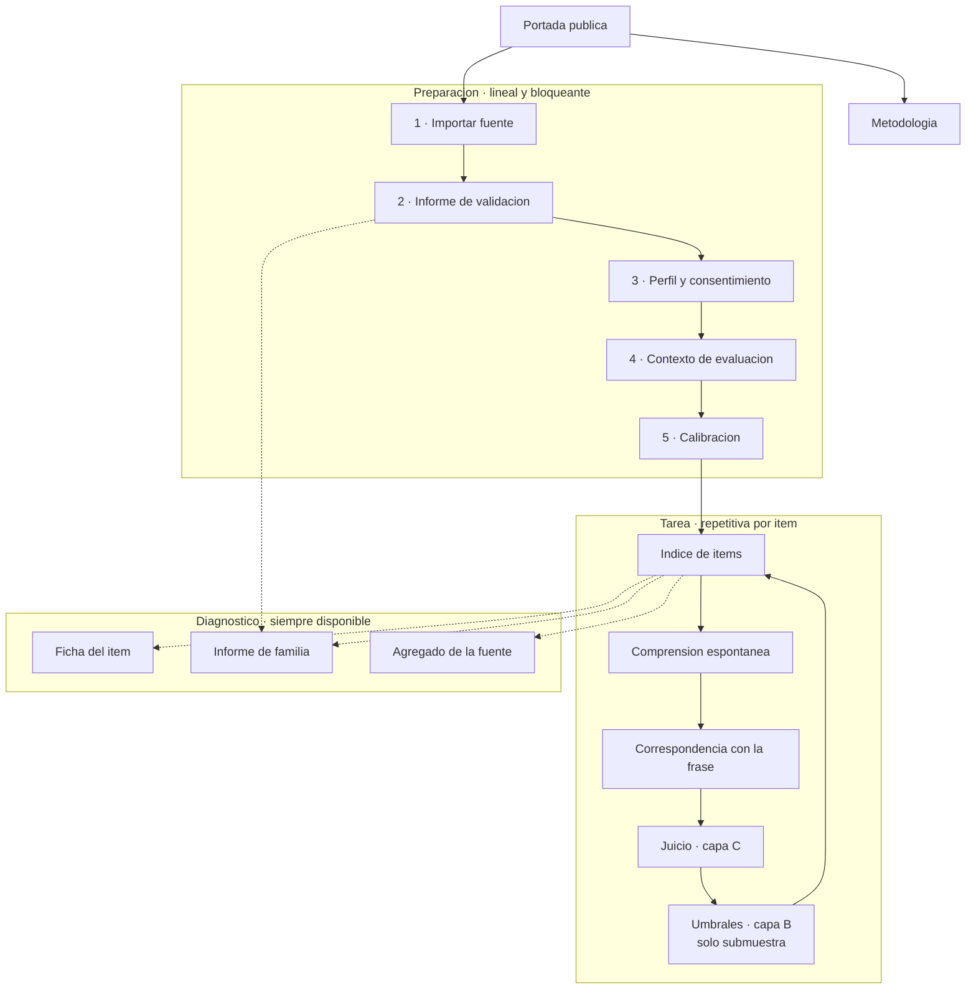
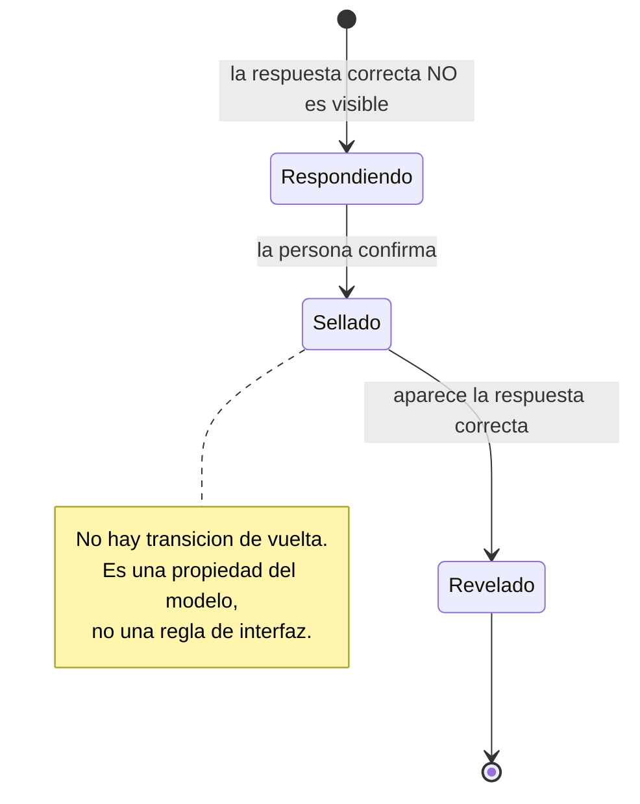

# ICAP v2: requisitos de front-end

Documento de trabajo, rama `v2`. Define tipos de pantalla, patrones de interacción y reglas de interfaz para el sitio público de evaluación. Su fuente de verdad de comportamiento es `spec/icap.allium`: cada garantía declarada allí es un requisito no negociable aquí.

Stack decidido: framework con build. Acceso: abierto, con datos etnográficos del evaluador y calibración previa bloqueante.

## 1. Marca

La marca principal es **ICAP**, sola. El nombre extendido acompaña como subtítulo, nunca como marca.

Hay una inconsistencia heredada que conviene resolver antes de escribir la página de metodología: el repositorio expande la sigla de dos maneras distintas. La interfaz de v1 dice *Índice de Calidad Pictográfica* y el módulo `ICAP-extract` dice *Image-Communication Accessibility Protocol*. No son lo mismo: un índice es un número resultante, un protocolo es un procedimiento. Dado que la v2 elimina explícitamente el puntaje único y lo reemplaza por un procedimiento con registros de evidencia, la segunda expansión describe mejor lo que el instrumento hace ahora, y la primera contradice la decisión de arquitectura más importante de la versión. La recomendación es adoptar *protocolo* y declarar el cambio en la documentación[^1].

En el pie y en los metadatos, ICAP se presenta como iniciativa de la red MediaFranca, y su relación con PICTOS.net se enuncia con la regla conceptual del instrumento: PICTOS.net publica bibliotecas, ICAP produce registros de evidencia sobre versiones exactas de sus pictogramas.

## 2. Arquitectura de navegación

El instrumento de v1 era un recorrido lineal de tres pasos y eso ya no alcanza. La v2 tiene tres regímenes de navegación simultáneos que no deben mezclarse: un tramo de preparación que es lineal y bloqueante, un tramo de tarea que es repetitivo por ítem, y un conjunto de vistas de diagnóstico que están disponibles en cualquier momento y no forman parte de ningún recorrido.

La consecuencia de forma es un armazón de dos niveles. Arriba, un indicador de preparación que avanza y no retrocede: mientras la sesión no esté calibrada, no hay acceso a la tarea. A un costado, una entrada permanente al diagnóstico, habilitada desde que la fuente queda analizada, que es antes de que el evaluador entregue un solo dato. Ese detalle no es cosmético: el informe de familia se calcula en segundos sin intervención humana, y mostrarlo temprano es lo que invierte la economía de v1, donde todo valor exigía trabajo previo.

Las líneas punteadas del diagrama importan tanto como las sólidas. El diagnóstico no es un paso final ni una recompensa: es una consulta lateral disponible desde el informe de validación en adelante.

## 3. Familias de pantalla

Las pantallas se agrupan por régimen de interacción, no por capa de medición. Un diseñador necesita saber cómo se comporta una pantalla antes que qué mide.

**Preparación.** Se recorren una vez por sesión, en orden, con avance bloqueante. Cada una tiene una condición de salida verificable y ninguna permite saltarse la anterior. Son: importar fuente, informe de validación, perfil y consentimiento, contexto de evaluación, y calibración.

**Tarea.** Se repiten por ítem y contienen los únicos momentos irreversibles del instrumento. Son: comprensión espontánea, correspondencia con la frase, juicio de capa C, y umbrales de capa B. Esta última aparece solo para los ítems de la submuestra.

**Diagnóstico.** No secuenciales, de solo lectura, disponibles en cualquier momento. Son: ficha del ítem, informe de familia y agregado de la fuente.

**Contexto público.** Accesibles sin sesión iniciada, indexables, enlazables. Son: portada y metodología.

**Administración.** Otro rol y otro momento. Son: codificación de respuestas abiertas, que ejecuta un tercero después de la sesión, y exportación.

## 4. Catálogo de pantallas

| Pantalla | Surface en la spec | Régimen | Condición de salida |
|---|---|---|---|
| Portada | — | público | ninguna |
| Metodología | — | público | ninguna |
| Importar fuente | `SourceImport` | preparación | fuente creada |
| Informe de validación | `ImportReportView` | preparación | informe leído y aceptado |
| Perfil y consentimiento | — | preparación | consentimiento con versión otorgado |
| Contexto de evaluación | — | preparación | contexto completo |
| Calibración | `CalibrationTask` | preparación | anclas reveladas |
| Índice de ítems | — | tarea | ninguna, es el eje |
| Comprensión espontánea | `SpontaneousComprehension` | tarea | respuesta cerrada u omitida |
| Correspondencia | `PhraseCorrespondence` | tarea | correspondencia registrada |
| Juicio capa C | `JudgmentEntry` | tarea | cuatro dimensiones con estado |
| Umbrales capa B | `ThresholdTask` | tarea | tres ejes, dos pasadas cada uno |
| Ficha del ítem | `ItemFicha` | diagnóstico | — |
| Informe de familia | `FamilyReportView` | diagnóstico | — |
| Agregado | `AggregateView` | diagnóstico | — |
| Codificación | `ResponseCodingView` | administración | codificación asignada |
| Exportación | — | administración | archivo generado |

## 5. Patrones de interacción

Estos son los patrones que distinguen a ICAP de un formulario de encuesta. Cada uno tiene una regla que la implementación no puede relajar.

### 5.1 Revelación diferida con sellado

El patrón central del instrumento, y aparece dos veces: en la comprensión espontánea y en la calibración. Su forma es siempre la misma. La persona responde con la respuesta correcta oculta, sella, y recién entonces se revela. En la comprensión, lo oculto es la frase objetivo; en la calibración, el ancla consensuada.

Las reglas. Antes de sellar, la interfaz advierte que el paso es irreversible, con una frase específica y no con un aviso genérico. El sellado exige una acción deliberada, nunca ocurre por navegación ni por tiempo. Después de revelar, se muestran ambas cosas juntas —lo que la persona puso y lo que era— porque el valor formativo está en la comparación, no en el número. Y el control de edición desaparece de la vista: no se deshabilita, se retira, porque un control deshabilitado invita a buscar cómo habilitarlo.

Este patrón necesita un tratamiento gráfico propio y reconocible, de modo que la segunda vez que aparezca la persona ya sepa qué va a pasar.

### 5.2 Método de ajuste con doble pasada

La interacción más novedosa y la más fácil de arruinar. La persona mueve un control continuo mientras el pictograma se degrada, hasta el punto en que ya no puede nombrar qué muestra.

Las reglas. La pregunta se formula como tarea con respuesta verificable, no como preferencia: *mueva el control hasta donde ya no pueda nombrar qué muestra el pictograma*, nunca *hasta donde le parezca legible*. El valor numérico del control no se muestra: verlo ancla la respuesta y convierte una medición en una estimación. Cada eje se recorre dos veces, una desde nítido hacia degradado y otra en sentido inverso, y la interfaz indica en qué pasada está sin revelar el valor de la anterior. El punto de partida se aleatoriza entre ítems y el orden de los ítems también, porque sin eso el aprendizaje del conjunto contamina las mediciones tardías.

El progreso se muestra sobre la submuestra, no sobre la biblioteca completa. Un evaluador que ve *ítem 3 de 50* cuando en realidad son 10 abandona por una razón falsa.

### 5.3 Estados de ausencia coequivalentes

Cada dimensión de la capa C admite cuatro estados: puntuada de 1 a 5, no aplicable, sin competencia para juzgar, y omitida. El fundamento es que forzar un 3 cuando la persona no sabe evaluar algo contamina más que aceptar la ausencia de dato.

La regla es de jerarquía visual y es la más fácil de violar sin darse cuenta. Los estados de ausencia deben tener el mismo peso gráfico que la escala, no aparecer como un escape secundario debajo de ella. Si *no tengo competencia para juzgar esto* se ve como una salida de emergencia, la gente pondrá 3 y el instrumento perderá exactamente la información que este diseño vino a preservar. Declarar falta de competencia abre un campo de motivo obligatorio; las otras dos formas de ausencia lo tienen opcional.

Ninguna dimensión arranca con valor por defecto, y el estado inicial es visiblemente distinto de cualquier estado elegido.

### 5.4 Veredicto con causa nombrada

Nunca un semáforo agregado. Cuando un ítem queda bloqueado, la interfaz muestra cuál de los tres vetos falló y por qué, con su magnitud. La forma es siempre estado más causa más valor, en la misma unidad en que se midió.

Complemento necesario: el perfil compensatorio se muestra como perfil, con un tratamiento gráfico claramente distinto del de los vetos, para que no se lea como una lista de fallas. Un ítem admisible con perfil débil y un ítem bloqueado son cosas distintas y deben verse distintas.

### 5.5 Separación de capas

Las cuatro capas no comparten unidad y por lo tanto no comparten gráfico. La ficha del ítem usa tres tratamientos distintos: barras contra umbral para la capa A, donde lo que importa es la distancia al criterio; valores en unidades físicas para la capa B, donde el número es el dato; y un triángulo para la capa C, que es el único lugar donde un radar es legítimo porque sus tres ejes sí son conmensurables.

Está prohibido cualquier gráfico que combine ejes de capas distintas. Esta prohibición es la razón de ser de la ficha de tres bandas y la causa de que el hexágono de v1 desapareciera.

### 5.6 Distinción entre lo verificado y lo exploratorio

El instrumento reporta cantidades con niveles de evidencia muy distintos, y la interfaz debe distinguirlos tipográficamente. Las métricas etiquetadas como hipótesis o como advertencia —A3 y A4 hoy— se muestran con un tratamiento que las separa de las demás y con su etiqueta visible, nunca como un puntaje más de la lista.

Los umbrales de configuración son editables y su condición de propuestas sin calibrar debe estar visible en el punto de edición, no escondida en la documentación.

### 5.7 Herencia visible

Los metadatos editoriales viven en la fuente y los ítems los heredan. La interfaz muestra siempre el valor efectivo, e indica de forma discreta si ese valor es heredado o es una excepción declarada por el ítem. En la exportación, la elección entre vista compacta y vista resuelta se ofrece explícitamente.

### 5.8 Versión anclada y evidencia superada

Cada registro se ancla a una versión exacta del ítem. Cuando el ítem cambia, los registros anteriores no se borran ni se corrigen: quedan marcados como referidos a una versión superada.

La regla de interfaz es que la evidencia superada se muestra, separada y etiquetada, nunca oculta. La ficha del ítem indica sobre qué versión se computó lo que se está viendo, y los registros de versiones anteriores viven en una sección propia. Ocultarlos sería la forma silenciosa de perder la trazabilidad que justifica todo el modelo de versiones.

### 5.9 Validación no silenciosa

El informe de ingesta es una pantalla bloqueante, no un aviso. Enumera filas válidas, parcialmente compatibles e inválidas, con su motivo, e incluye los identificadores duplicados, las imágenes ausentes, los formatos no admitidos, las frases vacías, las herencias aplicadas y las excepciones detectadas, más la versión de esquema reconocida. Es descargable antes de continuar. Nada se corrige en silencio, y por lo tanto la interfaz no ofrece ninguna acción de reparación automática.

## 6. Reglas heredadas de la especificación

Estas son las garantías declaradas en `spec/icap.allium`. Cualquiera de ellas que se rompa en la interfaz rompe el instrumento, no solo la experiencia.

| Garantía | Pantalla | Exigencia |
|---|---|---|
| `TargetPhraseHidden` | comprensión espontánea | la frase objetivo no está en el DOM de esa vista |
| `NoSilentRewrite` | comprensión espontánea | el control de edición se retira tras sellar |
| `AnchorsHiddenWhileScoring` | calibración | ancla y fundamento no se envían al cliente mientras se puntúa |
| `DivergenceNeverBlocks` | calibración | la divergencia se reporta, nunca impide continuar |
| `NoForcedMidpoint` | juicio capa C | ninguna dimensión con valor por defecto |
| `VetoesAreNamed` | ficha del ítem | todo bloqueo muestra su causa |
| `VersionIsVisible` | ficha del ítem | versión y hash visibles, superados aparte |
| `NoSingleAggregate` | informe de familia | ningún puntaje único |
| `PairDistributionReported` | informe de familia | distribución completa, no solo la cola |
| `NeverASingleNumber` | agregado | cobertura, personas, protocolo, desacuerdo y contextos |
| `EvidenceNeverMixed` | agregado | estadísticas separadas de los registros |
| `NeverSilentlyCorrected` | informe de validación | toda exclusión nombrada |
| `ReportIsDownloadable` | informe de validación | descarga antes de continuar |

La primera y la tercera tienen una implicación de implementación que conviene subrayar: no basta con ocultar visualmente. Si la frase objetivo o el ancla llegan al cliente y solo están escondidas por CSS, la garantía es decorativa. En un framework con build, esto significa que esas vistas piden solo los campos que pueden mostrar.

## 7. Estados de pantalla

Cada pantalla debe resolver cuatro estados además del normal. El vacío, cuando todavía no hay datos, que en la portada y el índice es la situación inicial legítima y no un error. El de carga, relevante sobre todo en la ingesta y en el cálculo de la capa D, donde la espera es real y conviene mostrar qué se está calculando. El de error, que nunca ofrece corrección automática. Y el parcial, que es el más frecuente y el peor atendido: una biblioteca con la mitad de los ítems evaluados, un ítem con capa C completa y capa B ausente por no estar en la submuestra, un agregado con pocos registros.

El estado parcial merece atención especial porque la v2 lo produce por diseño. Un ítem fuera de la submuestra no tiene datos de capa B y eso es correcto, no una omisión: la interfaz debe decir *no muestreado* y no *pendiente*, que sugiere una tarea que no existe.

## 8. Página de documentación de la metodología

Es una página pública, enlazable y sin sesión. Su función no es promocional sino de rendición de cuentas: explica qué mide el instrumento, cómo lo mide, y qué no está en condiciones de afirmar.

Su contenido mínimo son cinco bloques. Primero, qué es ICAP y qué lo distingue: la organización por origen del dato y el nivel de análisis de familia. Segundo, las catorce dimensiones en sus cuatro capas, con su escala y su grado de automatización, que es la tabla que ya existe en `docs/ICAP_v2_dimensiones.md`. Tercero, el protocolo: los dos momentos de comprensión, el método de ajuste con doble pasada, el muestreo de capa B y la calibración previa. Cuarto, y este es el bloque que ningún instrumento comparable publica, las limitaciones declaradas: qué eslabones de la cadena de inferencia tienen respaldo y cuáles no, qué métricas son hipótesis, y el hecho de que los umbrales son propuestas sin calibrar. Quinto, las referencias con enlace resoluble.

La página debe declarar además las cuatro versiones vigentes —esquema, rúbrica, protocolo y conjunto de calibración— porque un resultado solo es comparable si se conocen. Esa declaración es contenido, no metadato.

El tono es el mismo que rige los documentos del proyecto: afirmar lo que está fundado, marcar lo que es hipótesis, y no confundir determinismo con validez.

## 9. Pie de página y créditos

El pie aparece en todas las pantallas, incluidas las de tarea, donde va discreto. Contiene los créditos de autoría, la mención de ICAP como iniciativa de la red MediaFranca, el enlace al repositorio `mediafranca/ICAP`, el enlace a la página de metodología, la licencia, y las cuatro versiones vigentes en formato compacto.

Incluir las versiones en el pie no es un detalle técnico trasladado por comodidad: es coherente con la decisión de que rúbrica y protocolo viajan con el dato. Quien saca una captura de pantalla debería poder saber bajo qué protocolo se produjo lo que está viendo.

## 10. Accesibilidad

ICAP mide accesibilidad cognitiva, de modo que su propia interfaz está obligada a cumplir el estándar que evalúa. Esto no es una aspiración sino una consecuencia: uno de los roles de evaluador declarados en el modelo es *persona con dificultades de comunicación oral, usuaria de pictogramas*. Si la interfaz no es usable por ese rol, el instrumento excluye del juicio precisamente a la población para la que fueron hechos los pictogramas, y el sesgo resultante contamina la capa C entera.

Como piso, WCAG 2.1 AA completo: contraste, tamaño de objetivo táctil, navegación por teclado, foco visible, y textos alternativos en todos los pictogramas presentados. Como exigencia adicional propia del dominio, lenguaje llano en toda la copia de tarea, una sola pregunta por pantalla en los momentos de comprensión, y ninguna interacción que dependa exclusivamente de arrastre: el control de umbrales necesita alternativa por teclado con incrementos discretos.

Conviene someter las pantallas de tarea a la misma prueba de degradación que el instrumento aplica a los pictogramas. Es barato y es coherente.

## 11. Problemas abiertos de front-end

Hay un problema técnico que conviene resolver antes de implementar la capa B y que la especificación no puede resolver por sí sola. El umbral de tamaño, B2, se compara contra el tamaño real de presentación declarado en el contexto de evaluación, pero lo que la interfaz mide son píxeles de canvas, que no equivalen a tamaño físico: dependen de la densidad de la pantalla del evaluador y de su distancia de visualización, ninguna de las dos conocida. Sin resolverlo, los umbrales de tamaño no son comparables entre evaluadores y el veto B2 queda apoyado en una unidad ambigua. Las salidas posibles son declarar la distancia de visualización y estimar el ángulo visual, calibrar con un objeto de referencia de dimensiones conocidas al inicio de la sesión, o restringir el uso de B2 a comparaciones dentro de una misma sesión. La tercera es la más barata y la más honesta mientras no haya calibración física.

Quedan además tres decisiones menores. La persistencia local durante la sesión, dado que los registros son inmutables al sellar pero editables antes, y una recarga de página no debería perder trabajo. El comportamiento en móvil de la tarea de umbrales, que es la única pantalla donde el tamaño de la pantalla afecta al dato y no solo a la comodidad. Y la estrategia de idioma: la interfaz de v1 está en español, el corpus de referencia también, pero las referencias y el público académico son internacionales.

[^1]: El cambio de expansión afecta a `index.html`, al README y a `ICAP-extract/README.md`, que hoy se contradicen entre sí. Es una corrección de una línea en cada archivo y conviene hacerla antes de que la marca circule con el sitio público.
