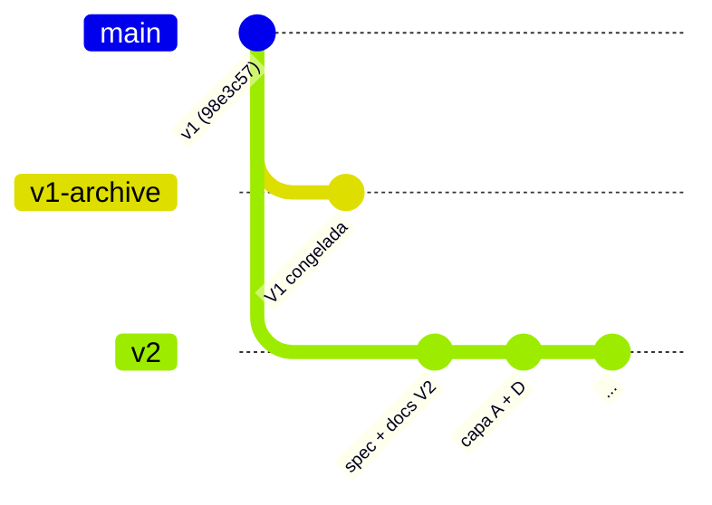
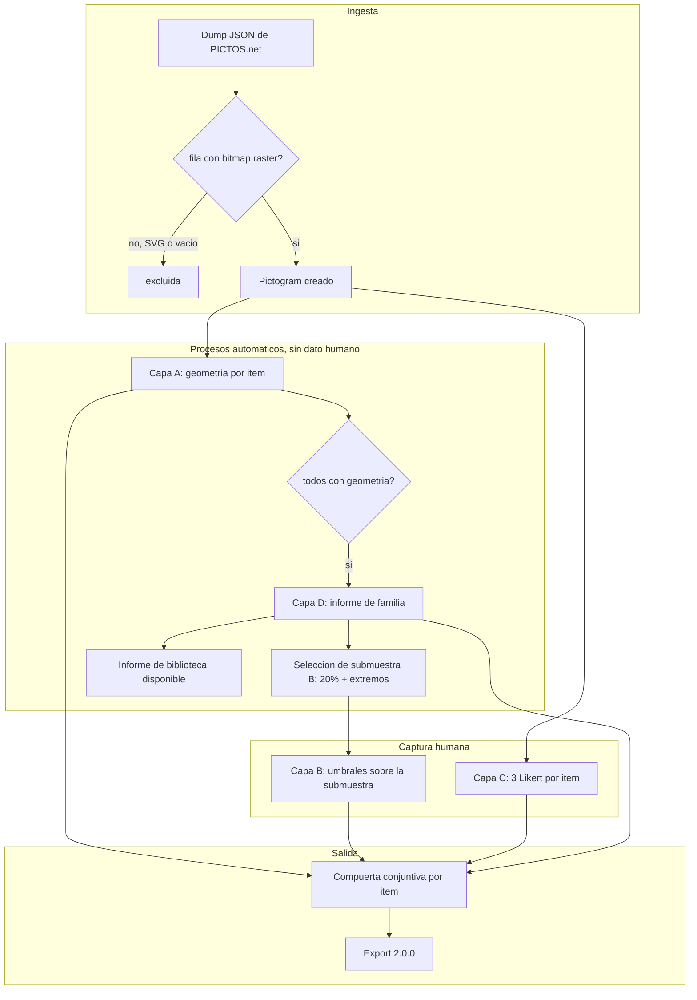

# ICAP v2: plan de implementación

Repositorio `mediafranca/ICAP`, rama `v2`. Documento operativo que acompaña a la especificación conceptual (`docs/ICAP_v2_especificacion.md`), el recuento de dimensiones (`docs/ICAP_v2_dimensiones.md`) y la especificación formal de comportamiento (`spec/icap.allium`).

Este plan define tres cosas: la estrategia de ramas y el archivo de V1, el flujo operativo de ingesta y procesos automáticos, y la secuencia de fases de construcción.

## 1. Estrategia de ramas y archivo de V1

V1 es un instrumento cerrado y publicable: evaluador de 3 pasos, seis Likert, hexágono, export `1.2.0`. No se toca. Se preserva como línea de archivo para que cualquier evaluación V1 existente siga siendo reproducible y comparable[^1].

La rama `v1-archive` ya existe apuntando al mismo commit que `main` (`98e3c57`): es el evaluador hexagonal congelado. El desarrollo de V2 ocurre en la rama `v2` y, cuando el instrumento nuevo esté estable, reemplaza a `main`. Mientras tanto, `main` sigue sirviendo V1 en GitHub Pages sin interrupción.

La regla de convivencia es que ninguna de las tres ramas depende de otra en tiempo de ejecución: `v1-archive` es inmutable, `main` es la versión publicada del momento, `v2` es el frente de trabajo.

## 2. Flujo operativo

El input no cambia: bibliotecas JSON exportadas de PICTOS.net (`payload.rows[]` con `bitmap` raster y `UTTERANCE`). Lo que cambia es lo que ocurre después de la carga.

El punto clave del flujo es que la carga dispara todo el tramo automático en cadena. Al terminar la ingesta se calcula la capa A por item; cuando todos los items tienen geometría, la biblioteca pasa a estado analizada, se computa el informe de familia y se selecciona la submuestra de la capa B. El evaluador recibe el informe de biblioteca antes de entregar un solo dato humano. Esto está formalizado en `spec/icap.allium` como el encadenamiento de las reglas `IngestLibraryDump`, `ComputeGeometry` y `CompleteAnalysis`.

La captura humana es posterior y parcial por diseño: la capa B se pide solo sobre la submuestra (tarea de nombrado con doble pasada por eje), y la capa C son tres Likert por item. La compuerta conjuntiva combina las cuatro capas en un semáforo por item, nunca en un promedio.

## 3. Fases de construcción

El orden respeta la prioridad de la sección 12 de la especificación: primero lo automático, que produce resultados publicables sin recoger un solo dato humano nuevo y valida la arquitectura antes de invertir en la interfaz de umbrales.

### Fase 1: Capa A y extracción de máscara

Construir el pipeline de ingesta y el cálculo geométrico. Entrega: al cargar un dump, cada pictograma queda con sus cuatro métricas A. Es la base de todo lo demás y da valor inmediato sin datos humanos. Corresponde a las reglas `IngestLibraryDump` y `ComputeGeometry` y al value type `GeometryLayer`. El cálculo de píxel (extracción de máscara, esqueleto, EDT) es una caja negra `compute_geometry` cuya especificación de detalle vive aparte.

Criterio de término: reproducir sobre la biblioteca de referencia las métricas de `metricas_so2027_icap.csv`.

### Fase 2: Módulo D (informe de familia)

Construir D1 (matriz de confusabilidad), D2 (coeficientes de variación) y D3 (ranking de fragilidad) como vista independiente. Es la contribución original de V2 y el argumento de publicación. Corresponde a la regla `CompleteAnalysis`, la especificación diferida `FamilyAnalysis.compute` y las entidades `LibraryReport` y `ConfusablePair`.

Criterio de término: reproducir los tres pares en alerta del set de referencia, con el peor (`Natación` / `Natación Aguas Abiertas`, r=0,94) marcado.

### Fase 3: Compuerta conjuntiva

Reemplazar el promedio de V1 por la compuerta conjuntiva. Es esfuerzo de horas y corrige un riesgo real. Corresponde a los derivados `meets_layer_a`, `meets_layer_b`, `meets_layer_c`, `in_confusable_pair` y `eligible` de `Pictogram`, más la invariante `EligibleNeverConfusable`.

Antes de cerrar esta fase hay que resolver las open questions sobre A3 en la compuerta, el proxy de la capa B para no muestreados y el tratamiento del N/A en C3[^2].

### Fase 4: Capa B con protocolo completo

Construir la medición psicofísica: los tres efectos en canvas sobre el bitmap ya cargado, doble pasada por histéresis, tarea de nombrado, aleatorización de partida y orden. Es el cambio metodológico de fondo. Corresponde a `ThresholdMeasurement`, las reglas `RecordDescendingPass` y `RecordAscendingPass`, la especificación diferida `ThresholdSampling.select` y la surface `ThresholdTask`.

### Fase 5: Ficha de tres bandas

Construir la visualización por item que reemplaza al hexágono: barras con umbral para A, unidades físicas para B, triángulo para C. Requiere que las fases 1, 2 y 4 existan. Corresponde a la surface `PictogramFicha`.

### Fase 6: Export 2.0.0 y legacy

Último, cuando el modelo de datos esté estable. Incluye el bloque `legacy_v1` con las seis dimensiones derivadas de forma aproximada para retrocompatibilidad. Corresponde a la regla `ExportEvaluation` y la entidad `Export`.

## 4. Qué queda abierto antes de fijar umbrales

Los umbrales de la sección 7.2 son propuestas sin calibrar, no constantes validadas, y casi toda la evidencia local viene de trece pictogramas de una sola familia gráfica. El paso honesto después de las fases 1 y 2 es correr el instrumento sobre dos o tres bibliotecas de estilos distintos antes de fijar umbral alguno. Hasta entonces, todo umbral vive en el bloque `config` de la especificación, editable y registrado en el export, y toda métrica marcada como hipótesis se muestra como dato exploratorio, nunca como puntaje validado.

Las decisiones aún no tomadas están registradas como open questions al final de `spec/icap.allium`.

[^1]: La retrocompatibilidad se apoya además en el bloque `legacy_v1` del export 2.0.0, que deriva las seis dimensiones de V1 desde las capas A y B según el mapeo de la sección 3.3 de la especificación. La derivación es aproximada y así debe documentarse.

[^2]: Estas tres decisiones cambian el resultado de la compuerta y por eso bloquean el cierre de la fase 3. La lectura provisional de la especificación formal es: A3 fuera de la compuerta (solo advertencia), capa B verdadera por vacuidad para no muestreados, y N/A excluido del mínimo y del promedio de C.
