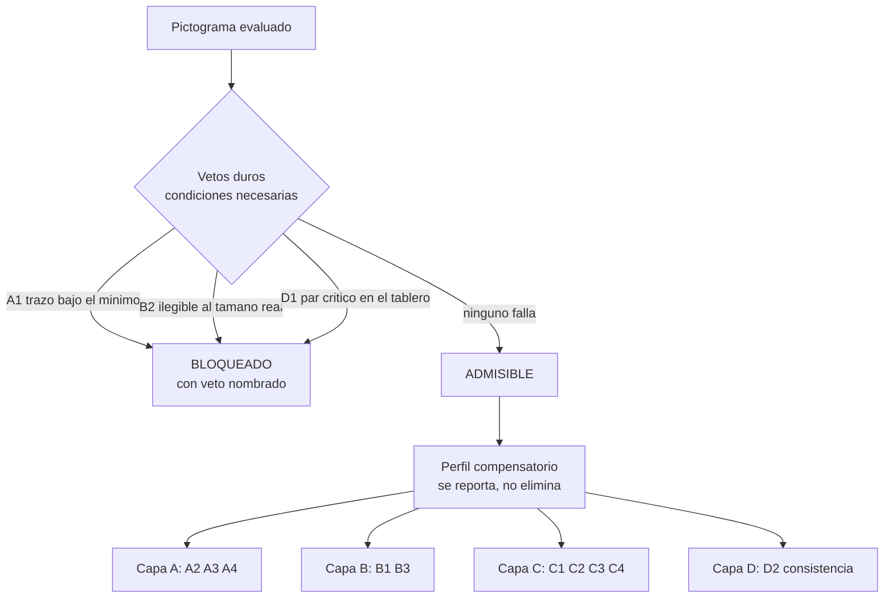

# Respuesta razonada a la evaluación externa de ICAP v2

Documento de trabajo, rama `v2`. Responde punto por punto a `ICAP_v2_evaluacion.md` y registra qué se aplicó a `spec/icap.allium`, qué se aplicó con corrección y qué queda pendiente.

## 1. Estado de la evidencia: por qué este documento no discute cifras

El análisis de referencia corrió sobre trece pictogramas cuando el corpus es de veintiuno. Esto invalida, hasta recomputar, todas las cantidades locales que circulan en la especificación y en la evaluación externa: el coeficiente de correlación de A1, su intervalo de confianza, las tasas de cumplimiento por criterio, el conteo de pares en alerta y la tasa de elegibilidad observada. También invalida el cálculo de supervivencia bajo compuerta conjuntiva que hice para verificar el defecto 1, porque estaba anclado en esas tasas.

La consecuencia metodológica es más interesante que la corrección aritmética. Un argumento que depende del valor de una correlación muere cuando el corpus cambia; un argumento sobre la estructura del instrumento no. Este documento retiene solo los segundos, y esa restricción resulta ser una prueba de resistencia útil: de las tres correcciones mayores propuestas, dos son estructurales y sobreviven intactas, y la tercera es precisamente la que hay que aplazar[^1].

## 2. Correcciones que se aceptan sin reserva

### 2.1 Determinismo no es validez

Es la observación más filosa de la evaluación y corrige un texto mío. En `ICAP_v2_dimensiones.md` escribí que la v2 gana reproducibilidad donde antes había opinión, y contabilicé como ganancia que siete dimensiones se calculen con determinismo perfecto. La objeción es correcta: un algoritmo que cuenta componentes conexas produce el mismo número siempre, y eso no dice nada sobre si ese número predice que alguien reconozca el signo. Lo que la v2 hace es sustituir una fuente de error, la variabilidad entre jueces, por otra, la validez de constructo no establecida, y mi documento contabilizaba solo la primera.

El marco de Kane es el correcto para plantearlo: lo que se valida no es el instrumento sino la interpretación y el uso propuestos de sus puntajes, mediante una cadena explícita de inferencias donde cada eslabón necesita respaldo propio. En ICAP la cadena es grosor de trazo medido, luego legibilidad perceptual, luego reconocimiento por el usuario, luego utilidad comunicativa en contexto. Hay respaldo de literatura para el segundo eslabón, evidencia local pendiente de recomputar para el primero, y ninguna evidencia para el tercero y el cuarto.

Esto no invalida el instrumento, obliga a declarar qué inferencia sostiene. La sección correspondiente de `ICAP_v2_dimensiones.md` debe reescribirse como tabla de cadena de inferencias con estado de evidencia por eslabón, que es el mismo gesto de honestidad que el documento ya practica en otras partes, aplicado donde más falta hacía.

### 2.2 Aprendibilidad como constructo separado

El argumento es de constructo, no de datos, y por eso sobrevive completo. Mizuko estableció al comparar Blissymbols, PCS y Picsyms que transparencia y facilidad de aprendizaje son propiedades distintas, y advirtió explícitamente que su estudio no aborda la efectividad a largo plazo. Alant y colaboradores midieron traslucidez de Blissymbols en niños con autismo sobre exposiciones repetidas y hallaron cambio significativo entre el primer y el tercer día. Isherwood y colaboradores mostraron que el peso relativo de las características del ícono cambia con la experiencia: la distancia semántica domina al inicio, la familiaridad después.

La consecuencia para ICAP es un sesgo de diseño, no un resultado de medición: tal como estaba, la v2 penaliza sistemáticamente a los sistemas de alta productividad composicional, donde la opacidad inicial es el precio deliberado de una gramática visual generativa. Un instrumento que no puede recomendar Bliss para ningún caso de uso está mal calibrado, no siendo estricto.

Se agregó `c4_learnability` a la entidad `Judgment` y el cruce `learning_profile` como enumeración de cuatro celdas. La celda opaco-pero-aprendible es un veredicto legítimo y distinto de opaco-y-difícil, y la ficha debe mostrarlo como celda, no como dos barras independientes.

### 2.3 El segundo término de Duncan y Humphreys, y su tensión con el primero

La evaluación tiene razón en que citábamos solo la mitad de la ecuación: la dificultad de búsqueda crece con la similitud objetivo-distractor y decrece con la similitud entre distractores. D1 mide el primer término, D2 el segundo.

Conviene ir un paso más allá de lo que la evaluación propone. No basta con decir que D1 y D2 son dos términos de la misma ecuación y reportarlos juntos: están en tensión directa. Si todos los ítems de una familia son muy similares entre sí, la homogeneidad favorece la búsqueda por agrupamiento de distractores, pero simultáneamente cada ítem se parece más a sus vecinos, lo que empeora la discriminación. El objetivo de diseño no es maximizar D2 ni minimizar D1 por separado, sino alcanzar alta homogeneidad de estilo con baja similitud de silueta. Eso es exactamente lo que logró la tradición Aicher y lo que un sistema mal resuelto pierde en cualquiera de las dos direcciones: familias heterogéneas que no se leen como sistema, o familias tan uniformes que sus miembros se confunden.

Esto refuerza la recomendación de la figura de portada en el plano D1 por D2 con un fundamento que la evaluación no le da. No es solo que ambos ejes sean conmensurables y que el gráfico sea legible de un vistazo, ventajas ciertas frente al hexágono. Es que ese plano visualiza la tensión que constituye el problema de diseño de una familia pictográfica, y ubica a la biblioteca evaluada en él. El hexágono comunicaba bien una medición mal fundada; este diagrama comunica igual de bien la única propiedad que la v2 mide y que ningún otro instrumento de CAA mide.

### 2.4 Evidencia de búsqueda visual con la población destinataria

Wilkinson y colaboradores mostraron, con participantes con síndrome de Down y con trastorno del espectro autista, que agrupar los símbolos por color interno acelera significativamente la búsqueda en ambos grupos. Es la cita que faltaba y desplaza a la capa D del terreno fundado en teoría general de la visión al terreno fundado en evidencia con usuarios de comunicación aumentativa. Incorporada como fundamento de `LibraryReport`.

### 2.5 Alineación de la capa B con ISO 9186

La v2 presentaba la degradación controlada como innovación metodológica cuando es la operacionalización de una distinción que la norma ya codifica: comprensibilidad por un lado, calidad perceptual bajo condiciones degradadas por otro. La v2 reproduce esa separación entre sus capas C y B sin nombrarla. Nombrarla cuesta un párrafo y compra comparabilidad externa. Incorporado como comentario normativo en `ThresholdAxis` y en la surface `ThresholdTask`.

### 2.6 Normas externas de complejidad de íconos

La capa A mide una versión de la complejidad visual para la que existen normas publicadas y medidas automatizadas ya establecidas. Conectarla con esa tradición da un punto de anclaje externo y una vía de validación convergente que no cuesta datos nuevos, y advierte sobre un confundido documentado entre complejidad y familiaridad que la v2 no estaba considerando. Incorporado como nota en `GeometryLayer`.

## 3. Correcciones que se aceptan con enmienda

### 3.1 La compuerta conjuntiva: conclusión correcta, justificación reemplazada

El argumento estructural es válido y no depende de ningún dato: la severidad de una regla conjuntiva se compone multiplicativamente con el número de criterios, de modo que una compuerta suficientemente larga rechaza casi todo, y una regla que rechaza todo informa exactamente lo mismo que una que acepta todo. Esa es una propiedad matemática, no una observación empírica, y sobrevive al cambio de corpus.

Dos enmiendas, una de hecho y otra de fondo.

La de hecho: la evaluación cuenta trece criterios en la compuerta, pero la especificación formal que escribimos tiene menos. A3 ya estaba excluida y reportada solo como advertencia, y la capa B era vacuamente verdadera para los ítems fuera de la submuestra, que son la mayoría. El conteo real era de nueve criterios para un ítem muestreado y seis para uno no muestreado. La magnitud del problema estaba sobreestimada, aunque su dirección no.

La de fondo, que es la que importa. La evaluación argumenta que A1 no debería ser veto porque su intervalo de confianza es demasiado ancho. Ese razonamiento hace depender la arquitectura del instrumento de la magnitud de una correlación, y por eso es exactamente el tipo de argumento que acaba de caerse con la corrección del corpus. Hay una justificación mejor y disponible: A1 no es un predictor estadístico sino un piso físico. Un trazo por debajo de cierto grosor relativo desaparece al tamaño de presentación, del mismo modo que B2 marca el tamaño bajo el cual el signo deja de nombrarse. Ambos son condiciones necesarias de legibilidad, no correlatos de ella. D1 es una condición necesaria de discriminabilidad, del mismo orden lógico pero relacional.

Reformulada así, la pregunta correcta no es conjuntiva contra compensatoria sino cuáles criterios son condiciones necesarias. Una condición necesaria es no compensable por definición: no hay excelencia semántica que redima un signo que no se ve, ni adecuación cultural que resuelva que el usuario seleccione el pictograma equivocado. Todo lo demás es perfil de calidad, donde la fortaleza en un aspecto sí puede razonablemente compensar la debilidad en otro.

La arquitectura implementada, con los tres vetos que decidiste:

La invariante `BlockedAlwaysHasNamedVeto` hace máquina-verificable que ningún ítem se rechace por acumulación de perfil: si está bloqueado, hay un veto identificado y nombrable en la interfaz. La surface `PictogramFicha` lo garantiza del lado del contrato con `VetoesAreNamed`.

### 3.2 Multiplicidad en D1: el problema es real, el diagnóstico no

La evaluación pide control de tasa de falso descubrimiento sobre la matriz de confusabilidad, señalando que una biblioteca de cien ítems genera casi cinco mil pares. La preocupación es correcta y el mecanismo propuesto no corresponde: D1 tal como está especificada no es una prueba inferencial sino un corte fijo sobre un coeficiente de correlación. No hay valores p que corregir.

El problema real es otro y es peor. Un corte importado y fijo, aplicado a un número de pares que crece cuadráticamente con el tamaño de la biblioteca, produce alertas por construcción: bibliotecas grandes acumularán pares sobre el umbral por el solo hecho de tener más pares, y el módulo que constituye la contribución original de la v2 será el primero en perder credibilidad ante un revisor. La corrección adecuada no es controlar multiplicidad sino derivar el corte de la distribución de pares de la propia biblioteca.

`LibraryReport` incorpora ahora `pair_median_r`, `pair_p90_r` y `critical_r_cutoff`, y los pares críticos se definen contra ese corte derivado. La garantía `PairDistributionReported` obliga a mostrar la distribución completa, no solo la cola marcada. Cómo se deriva exactamente el corte queda como pregunta abierta, porque esa sí depende de los datos.

### 3.3 Coeficiente de fiabilidad entre jueces: aceptado y condicional

La observación es correcta para escalas ordinales de cinco puntos, y la elección entre coeficientes cambia las conclusiones. Pero es condicional a una decisión que la v2 todavía no ha tomado: si el instrumento admite varios evaluadores por biblioteca. La especificación actual hereda de v1 un perfil único de evaluador. Queda registrado en las preguntas abiertas junto con la decisión de la que depende.

## 4. Lo que queda pendiente de los datos

Los umbrales absolutos frente a percentiles relativos a la biblioteca. El argumento de la evaluación es de precisión estadística y por eso es justamente el que hay que recomputar. Hay, sin embargo, una versión no cuantitativa que sí se sostiene y que ya estaba en la especificación: los valores actuales provienen de las anclas verbales de la rúbrica v1 y de literatura de población general, de modo que su transferencia a esta población y a este estilo gráfico es desconocida cualquiera sea el tamaño del corpus. Por eso el bloque `config` mantiene su etiqueta de marcadores de posición no calibrados, y la arquitectura queda preparada para ambas opciones: `critical_r_cutoff` ya opera de forma relativa a la distribución, lo que demuestra que el mecanismo es implementable sin rehacer el modelo de datos.

El criterio de aceptación merece un comentario aparte. La evaluación sugiere adoptar el sesenta y seis por ciento en lugar del ochenta y cinco, apoyándose en un estudio que interpreta sus datos en esa dirección. Adoptar cualquiera de los dos sería repetir el error que la propia evaluación denuncia: importar un umbral calibrado en otra población. La población destinataria de ICAP no es la población general que la norma contempla, y ese es precisamente el motivo por el cual el instrumento existe. Lo que sí se acepta es la obligación de declarar a qué criterio se adscribe y argumentarlo.

La estratificación por categoría gramatical queda como hipótesis contrastable, no como cambio inmediato. El hallazgo de dependencia gramatical en la transparencia de pictogramas ARASAAC es directamente relevante, y las bibliotecas de PICTOS traen el enunciado, de modo que la categoría es derivable. Es una hipótesis que los datos de la propia v2 pueden probar.

## 5. Donde la evaluación subestima un costo

C4 se aceptó, pero la evaluación no cobra dos precios que conviene dejar escritos.

El primero es de constructo. Mizuko y Alant midieron aprendibilidad mediante exposición repetida; lo que la v2 incorpora es una estimación del evaluador sobre cuánta exposición requeriría un signo. Son instrumentos distintos y el segundo es más débil: pide una predicción sobre un proceso que los estudios citados observaron directamente. La estimación es defendible como aproximación operativa, pero debe etiquetarse como tal y no presentarse como medición de aprendizaje. Queda registrado en la entidad `Judgment` y como pregunta abierta sobre un eventual módulo longitudinal.

El segundo es operativo. La capa C pasa de tres a cuatro juicios Likert por ítem, lo que incrementa en un tercio el costo humano de la capa más cara del instrumento. Sigue siendo más liviana que los seis juicios de v1, de modo que el argumento de operatividad se mantiene, pero el presupuesto de tiempo por biblioteca que figura en la especificación debe recalcularse.

## 6. Resumen de cambios aplicados

| Punto | Veredicto | Efecto en `spec/icap.allium` |
|---|---|---|
| Determinismo no es validez | aceptado | pendiente en `ICAP_v2_dimensiones.md`, no afecta la spec |
| Compuerta conjuntiva | aceptado con justificación reemplazada | `verdict`, tres vetos, perfil compensatorio, dos invariantes |
| C4 aprendibilidad | aceptado con limitación declarada | `c4_learnability`, `LearningProfile`, cruce C1 por C4 |
| Segundo término de Duncan y Humphreys | aceptado y ampliado a tensión D1-D2 | fundamento de `LibraryReport`, figura de portada |
| Evidencia CAA de búsqueda visual | aceptado | fundamento de `LibraryReport` |
| ISO 9186 | aceptado | nota normativa en `ThresholdAxis` y `ThresholdTask` |
| Multiplicidad en D1 | aceptado con mecanismo corregido | corte derivado de la distribución de pares |
| Normas de complejidad de íconos | aceptado | nota de validación convergente en `GeometryLayer` |
| Coeficiente ordinal de fiabilidad | aceptado, condicional | pregunta abierta ligada a multi-evaluador |
| Umbrales por percentiles | aplazado | `config` sigue etiquetado; arquitectura preparada |
| Criterio 66 frente a 85 por ciento | rechazado como valor, aceptado como obligación de declarar | pregunta abierta |
| Categoría gramatical | aceptado como hipótesis | pregunta abierta |

## 7. Lo que no cambió, y por qué importa

Ninguna de las correcciones tocó la decisión arquitectónica central de la v2, que es organizar el instrumento por origen del dato en lugar de por objeto de medición. Las cuatro capas siguen donde estaban, el pipeline automático sigue entregando diagnóstico antes de pedir un solo dato humano, y la separación entre lo que un script mide y lo que requiere juicio humano competente sigue siendo la razón por la cual el instrumento es a la vez más barato y más informativo que v1.

Lo que cambió es cómo se combina lo medido: de una compuerta que rechazaba por acumulación a un veredicto que nombra su causa, y de un instrumento que medía solo el primer encuentro con el signo a uno que distingue el primer encuentro del rendimiento tras el aprendizaje. Ambos cambios hacen al instrumento más difícil de falsear involuntariamente, que ha sido el criterio rector de toda la v2.

[^1]: Conviene notar la asimetría: las correcciones que sobreviven son las que se apoyan en literatura externa verificada o en propiedades formales del instrumento, y la que se aplaza es la que se apoyaba en el propio corpus de referencia. Es un argumento a favor de sostener el diseño en literatura citable mientras la evidencia local se consolida, que es lo que la especificación ya declaraba hacer.
